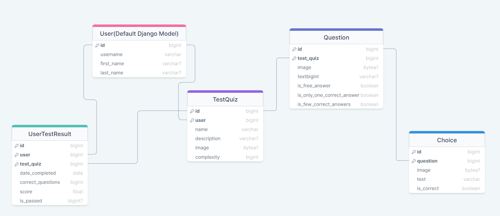
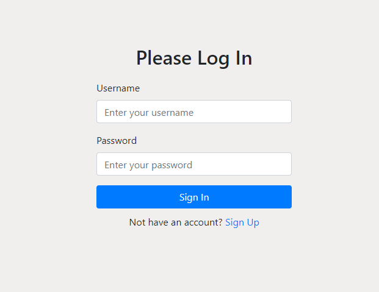
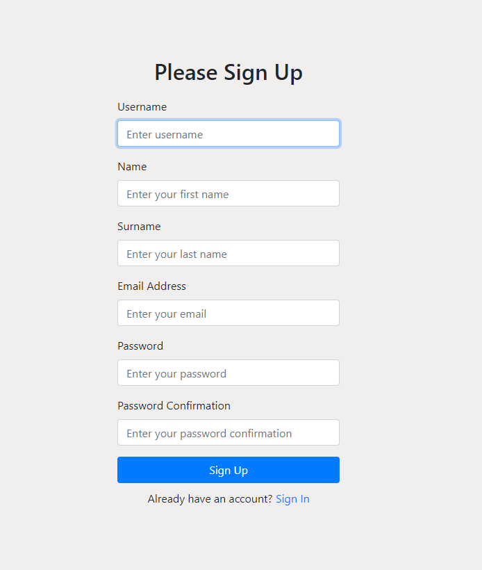
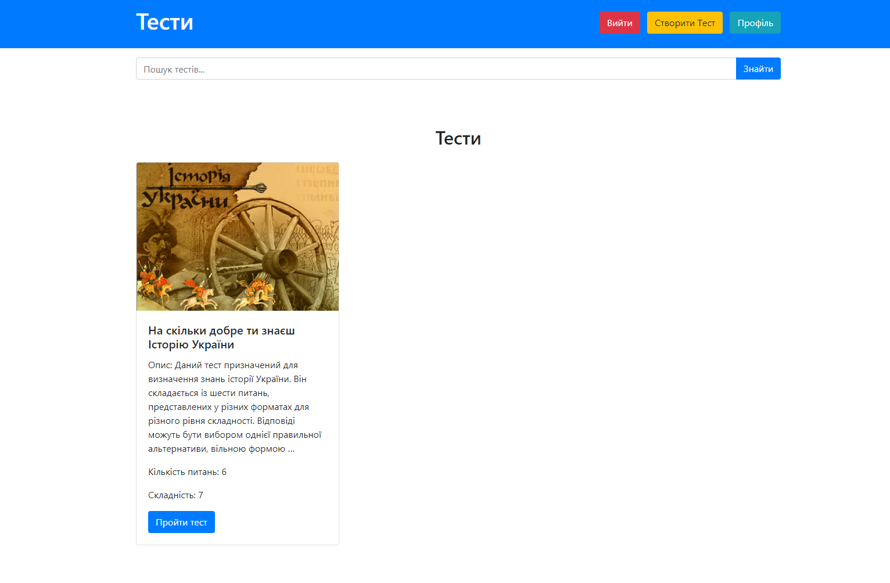
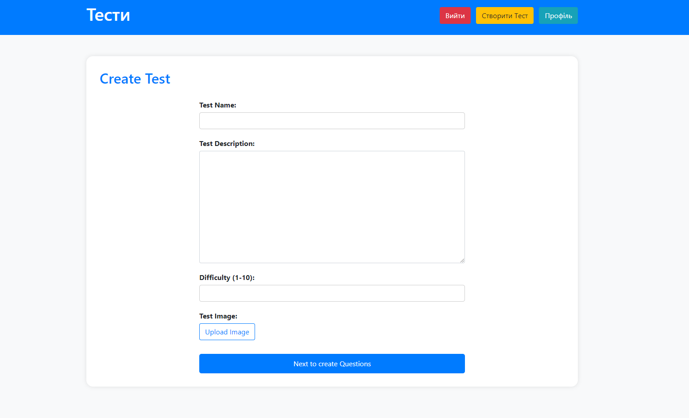
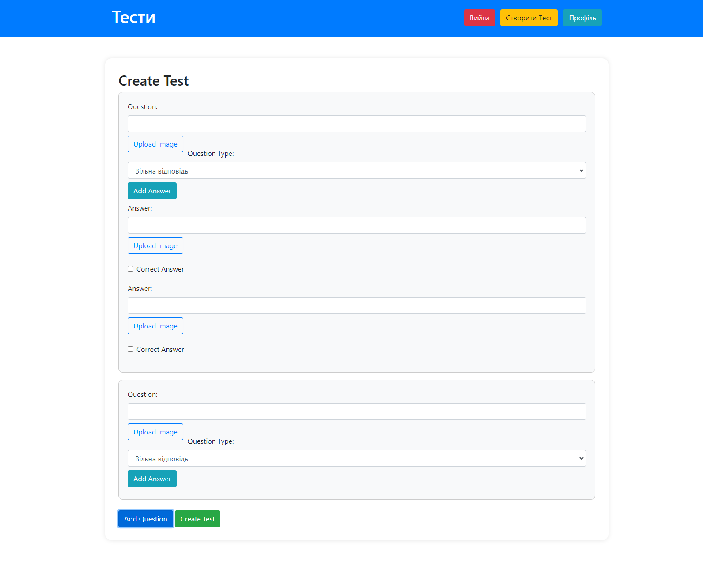
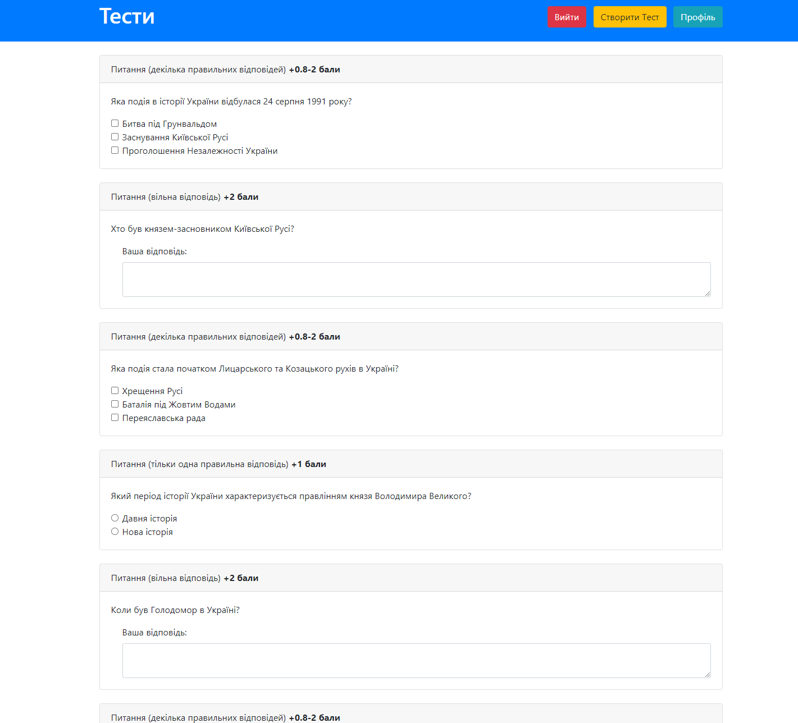
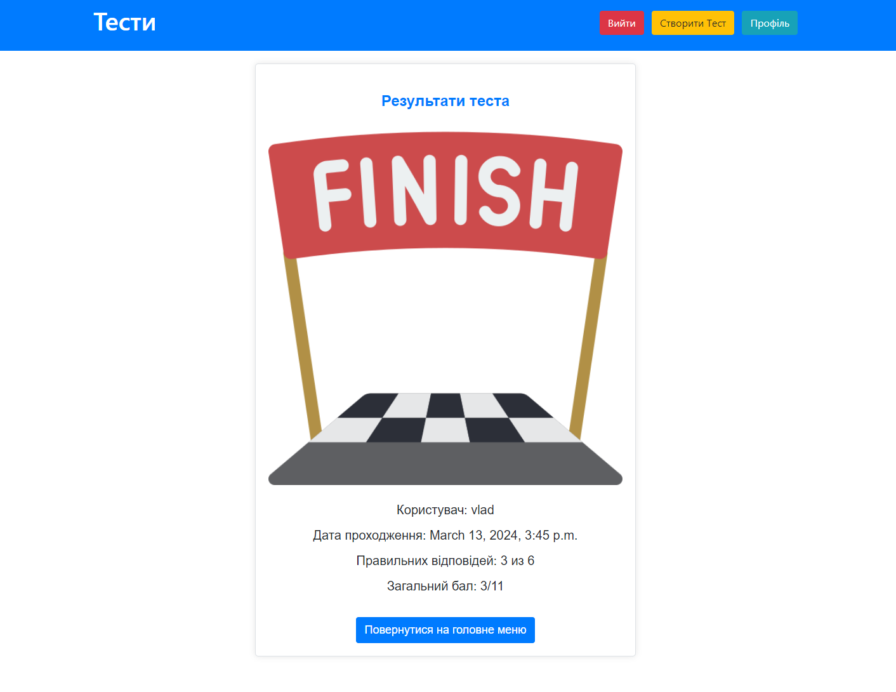
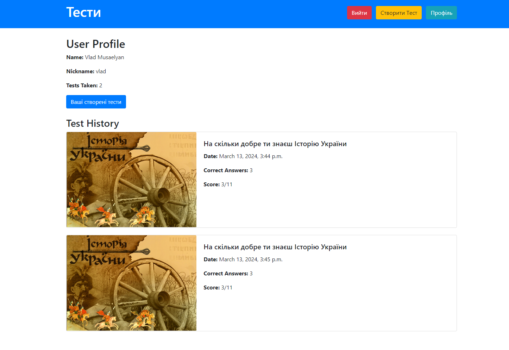
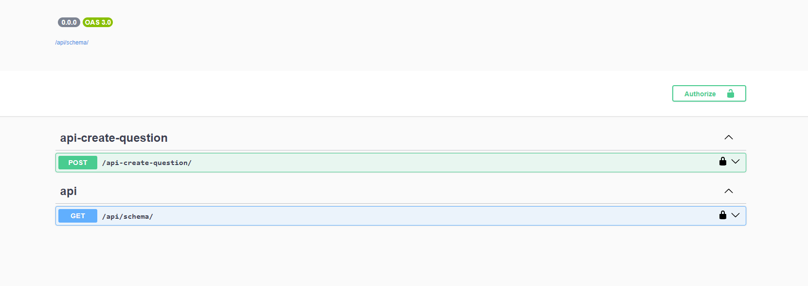

# TestQuiz-App

## Technology Stack:
* Python/Django/DRF
* PostgreSQL
* Elasticsearch
* HTML/Bootstrap/JavaScript/Ajax
* unittesting
* API Documentation (Swagger)

## Instruction how to run a project with Docker

Before starting the project, you need to set .env file to ./docker directory
```dockerfile
SECRET_KEY_DJANGO=

DB_NAME=
DB_USER=
DB_PASSWORD=
DB_HOST=
DB_PORT=
```

After that you can run this commands:
```dockerfile
docker-compose up -d --build
```
By this url you can achieve the site: http://127.0.0.1:8000/

To run tests you need to enter this command:
```dockerfile
docker-compose exec backend python manage.py test
```

# Project Description
Db Structure


## TestQuiz:
* Purpose: Blueprint for a test entity.
* Function: Stores details about a test, like its owner, name, description, image, and complexity.

## Question:
* Purpose: Defines a question within a test.
* Function: Holds information about a question, such as text, image, and settings for answer types.

## Choice:
* Purpose: Represents a potential answer for a question.
* Function: Stores information about a choice, including text and correctness status.

## UserTestResult:
* Purpose: Captures a user's performance in a test.
* Function: Records details such as the user, test taken, date completed, correct questions count, overall score, and pass status.

# Search (Elasticsearch)
Optimized website search using Elasticsearch with duplicated database records for enhanced performance. 
Integrated user-friendly search, implemented Elasticsearch queries, and ensured seamless presentation of results on the site.


# Screenshots from site:
## Login/Register



## Main Page with Tests


On the main page you have ability to create tests, logout, search, and try tests

## Create Test


First, you need to create test, name, description, image if you want, and complexity



After creating a test, you can add any types of answers and any quantity you want.

#  Pass the test




# Profile page



# API Documentation

